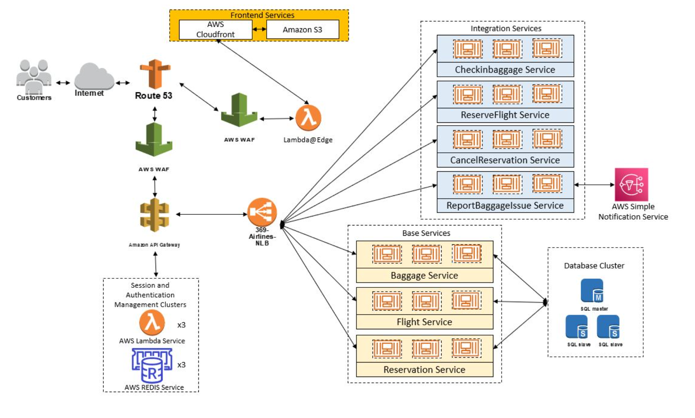

# Project 

## Overview of our solution

Please note that the current set of applications are tailored to run on the cloud, therefore it may not build properly on a local machine.
Build Instructions:
- Frontend:

`cd app/frontend`

`npm run build`.

Backend services (Baggage, CancelReservation, Checkin, Flight, Reservation, ReserveFlight):
- In each of their own respective subfolders, execute
`./gradlew bootJar`.

For test running the application,
- Frontend:

`cd app/frontend`

`npm run serve`.

- Backend:

In each of their own respective subfolders, execute

`./gradlew bootRun`.

## Note:
Changes to SQL DB Connection is required in the following paths:
./app/baggage/src/resources/application.properties
./app/flight/src/resources/application.properties
./app/reservation/src/resources/application.properties

Import `sample_data.sql` into your database to provision sample data.

Also, each controller in `checkinbaggage`, `reportlostbaggage`, `reserveflight`, `cancelation` should be updated with the latest end point URL of the `baggage`, `flight`, and `reservation` srevices.

To deploy to docker, user the folders in `/docker-deployment-skeleton` to build your docker package. You must copy in the compiled packages from `/app/<service_name>/build/lib/<component_name>.jar` in the `bin` folder of the service named directory in the `docker-deployment-sekeleton` directory.

Once that is then, you are now ready to deploy!
