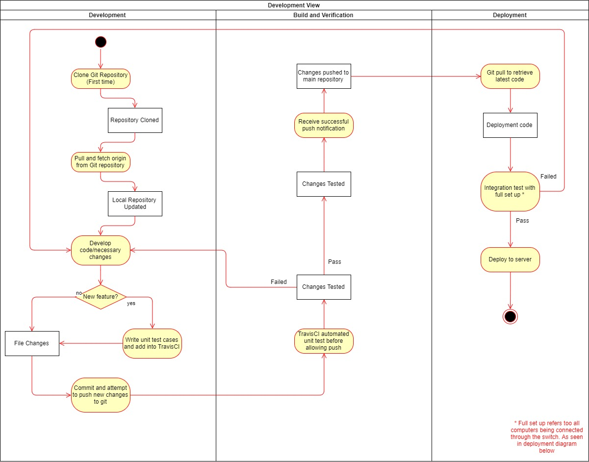
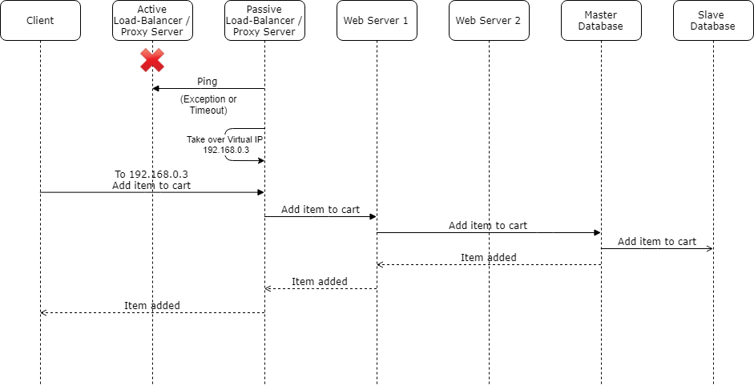
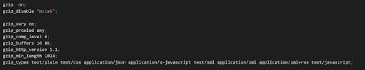

# SMU IT!
CS301 IT Solution Architecture - G1T7

E-commerce Application

## Table of Contents

1. [Description](#Description)  
1. [Solution Overview](#Solution-Overview)  
1. [Development Process](#Development-Process)  
1. [Availability](#Availability)  
1. [Security](#Security)  
1. [Performance](#Performance)
1. [Maintainability](#Maintainability)
1. [Software Dependencies](#Software-Dependencies)  
1. [Set Up](#Set-Up)
1. [Performance Test](#Performance-Test)
1. [Travis Test](#Travis-Test)
1. [Integration Test](#Integration-Test)

## Description
SMU IT! is an online e-store to for the public to search and purchase the IT products. It allows online payment through STRIPE. Users are allowed to give their review on the product. Admin users are allowed to manage the inventory and orders. 

## Solution Overview
#### Network Diagram


#### Deployment Diagram


## Development Process
#### Activity Diagram


## Availability
#### All Services Working


#### Fail-Over: Master Database Down


#### Fail-Over: Web Server 1 Down


#### Fail-Over: Active Load-Balancer Down


## Security

#### Network Diagram: Firewall Configuration


#### OWASP ZAP: Before and After


#### Cross Site Scripting
* HiddenID represents the item ID which accept only integers, therefore we use a try catch block to catch errors from alphabetical inputs.


#### SQL Injection


#### MIME Sniffing 


#### Clickjacking


## Performance

#### Prefetch
* Images are downloaded and stored in the browser cache where it can be easily and quickly accessed when needed.
* This improves user experience by decreasing time taken to render a page. 
* Prefetching images will enable smoother transition between pages since resources are not requested again every time


#### Caching
* Caching increases performance of data retrieval by reducing the need to access storage layer
* Client-side caching was implemented to reduce the latency involved when requesting web resources from websites


#### Gzip Configuration
* Data size affects data transferred from web server to client. 
* Gzip compress data before passing it through the network to the client which then decompress and reads the data. This lowers the amount of data to transfer, reducing processing and response time



#### Network Diagram: GZip and Caching


#### JMeter: Initial Performance Test


#### JMeter: Final Performance Test


## Maintainability
#### 1) Proxy Singleton for Database Connection


#### 2) Facade for Payment


#### 3) Builder For User Creation


#### 4) Builder for Inventory


#### 5) Singleton for Cart


#### 6) Singleton for SQL Calls


----
## Software Dependencies
Download the following softwares required for the project:
1. Download Eclipse IDE 2019-06
2. Java SDK 11
3. MySQL WorkBench

## Set Up

### Local Set-up (For Integration Testing)

Set up locally on a single computer to run the application with one database and one web server, this is for integration testing to ensure that the application works.

First, git clone or download the project onto your computer.

#### Setting up Database: 

1) Open MySQL WorkBench and start a local instance with default parameters

2) Create the instance with the `username: "root"` and `password: ""`

3) Double-click the local instance to begin

4) Select Server [Symbol] Data Import from the top menu bar

5) Look for the SQL file `project-a/app/smu_it.sql` and import

#### Setting up Application:
1) Start Eclipse, `File tab > New > Project`. Then under `General`, select `Project` and `Next`. Enter a project name, uncheck "use default location", search for `project-a/app/SMU_IT/SMU IT` folder

2) Click on `Project tab > Properties > Project Facets`. On the right side of the window, select `Runtimes` tab and click on `New`. Select `Apache Tomcat 8.0` and `Next`, search for `project-a\app\SMU_IT\Tomcat 8.0` folder and click `Finish`

2) Go to `project-a/app/SMU_IT/SMU IT/src/model/SQLCallSingleton.java` and edit it to show the following:

```
private SQLCallSingleton() {
    connURL = "jdbc:mysql://localhost:3306/smu_it";
    user = "root";
    pw = "";
    ...
}
```

3) In Eclipse, go to `File` tab and click on `Export`. Then click on `Web > WAR file`. Select the web project and Destination and save it as "SMU_IT.war". Place the `.war` file into `project-a/app/SMU_IT/Tomcat 8.0/webapps` (replace existing .war file if it is there and delete existing project folder if inside)

4) Preferably on an external editor, go to `project-a/app/SMU_IT/Tomcat 8.0/conf/context.xml` and edit it to show the following:

```
<Store className="org.apache.catalina.session.JDBCStore"      
  connectionName="root"
  connectionPassword=""
  connectionURL="jdbc:mysql://localhost:3306/smu_it"
  ...
  />
```

5) Go to `project-a/app/SMU_IT/Tomcat 8.0/bin` and start `startup.bat` to run server

---

### Full Set-Up (5 Computers):

First, connect all 5 computers to a switch using Eternet Cables, and git clone or download the project for each computer. Then follow the below instructions (for Windows 10 computers).

#### Computer 1 (192.168.0.1) (Master Database):
  1) On your computer, go to `Start > Search > View Network Connections`. Right click the `Ethernet` connection your computer is using, click on Properties. Under `Networking` tab, select `Internet Protocol Version 4 (TCP/IPv4)` and Properties. Change your IP Address to `192.168.0.1`.
  
  2) Obtain the SQL script from `project-a/app/smu_it.sql`. With Phpmyadmin, run the SQL script to set up the database.

  3) Using Phpmyadmin under Replication, configure Master replication
  
  4) To identify the master server, insert the following into `my.ini` which can be found under `wamp > mysql`:
  ```
	server-id=1134970
	log_bin=mysql-bin
	log_error=mysql-bin.err
  ```
	
  *server-id can be any unique number between 2 and 2^32 - 1

  5) Create a user for slave server to access with:
	  - Through `phpmyadmin > user accounts > add user account`
	  - For the project:
		  - User name: itsa_slave
		  - Host name: Any host
		  - Password: itsa
		  - Authentication Plugin: Native MySQL authentication
	  - Grant `"Replication Client"` and `"Replication Slave"`

  6) Open MySQL console and run the following command to grant replication slave:
	  - GRANT REPLICATION SLAVE on `*.*` TO `'itsa_slave'@'%';`

  * This is a one time configuration

#### Computer 2 (192.168.0.2) (Slave Database):
  1) On your computer, go to `Start > Search > View Network Connections`. Right click the `Ethernet` connection your computer is using, click on Properties. Under `Networking` tab, select `Internet Protocol Version 4 (TCP/IPv4)` and Properties. Change your IP Address to `192.168.0.2`.

  1) Using Phpmyadmin under Replication, configure slave replication

  2) To identify the master server, insert the following into `my.ini` which can be found under `wamp > mysql`:
```
  server-id=2
```
  *server-id can be any unique number between 2 and 2^32 - 1

  3) To allow arbitrary server access, insert the following into config.inc.php which can be found in `C:/wamp64/apps/phpmyadmin4.7.4/config.inc.php`:
```
  $cfg['AllowArbitraryServer'] = true;
```
  * This is a one time configuration

  4) Under replication, start slave (to be performed for each connection)

#### Computer 3 (192.168.0.3) (NginX Load Balancer / Proxy Server):
  1) On your computer, go to `Start > Search > View Network Connections`. Right click the `Ethernet` connection your computer is using, click on Properties. Under `Networking` tab, select `Internet Protocol Version 4 (TCP/IPv4)` and Properties. Change your IP Address to `192.168.0.3`.

  2) Go to `project-a/app/set up config files and script/` and save the Nginx Folder `nginx-1.17.5` into your computer.
 
  3) Navigate into the Nginx folder via Command Prompt. 
 
  4) To start Nginx, enter the command: `start nginx`
  
  5) To check if the service is running, enter the command: `tasklist /fi "imagename eq nginx.exe"`. You should get the following results:

```
Image Name                     PID Session Name        Session#    Mem Usage
========================= ======== ================ =========== ============
nginx.exe                    13536 Console                    1      7,840 K
nginx.exe                    29900 Console                    1      8,184 K
nginx.exe                    30420 Console                    1      8,192 K
```
6) To turn off the server, enter the command: `nginx -s stop`

7) **Only for Passive Load Balancer:** Follow the same steps above. Then go to `project-a/app/set up config files and script/` and run `Passive Load Balancer.bat` file as Admin. The file will ping the active load balancer every second. If the active load balancer does not respond, the Passive Load Balancer will take over the Active Load Balancer's IP address (virtual IP)

#### Computer 4 (192.168.0.4) & Computer 5 (192.168.0.5) (Tomcat Web Servers):
  
  1) On your computer, go to `Start > Search > View Network Connections`. Right click the `Ethernet` connection your computer is using, click on Properties. Under `Networking` tab, select `Internet Protocol Version 4 (TCP/IPv4)` and Properties. Change your IP Address to `192.168.0.4` or `192.168.0.5`

  2) To set up project, start Eclipse and go to `File tab > New > Project`. Then under `General`, select `Project` and `Next`. Enter a project name, uncheck "use default location", search for `project-a/app/SMU_IT/SMU IT` folder

  3) While in Eclipse, click on `Project tab > Properties > Project Facets`. On the right side of the window, select `Runtimes` tab and click on `New`. Select `Apache Tomcat 8.0` and `Next`, search for `project-a\app\SMU_IT\Tomcat 8.0` folder and click `Finish`

  2) Go to `project-a/app/SMU_IT/SMU IT/src/model/SQLCallSingleton.java` and edit the following:

  ```
  private SQLCallSingleton() {
      connURL = "jdbc:mysql://192.168.0.1:3306/smu_it";
      user = "itsa_access";
      pw = "itsa";
      ...
  }
  ```

  3) Use Eclipse to export as `.war` file and place it into `project-a/app/SMU_IT/Tomcat 8.0/webapps` (replace existing .war file if it is there and delete existing project folder if inside)

  4) Preferably on an external editor, go to `project-a/app/SMU_IT/Tomcat 8.0/conf/context.xml` and edit the following:

  ```
  <Store className="org.apache.catalina.session.JDBCStore"      
    connectionName="itsa_access"
    connectionPassword="itsa"
    connectionURL="jdbc:mysql://192.168.0.1:3306/smu_it"
    ...
    />
  ```

  5) Go to `project-a/app/SMU_IT/Tomcat 8.0/bin` and start `startup.bat` to run server

  ## Performance Test

  1) Start JMeter
  2) Import `SMU_IT Jmeter Performance Test.jmx` from `project-a/app/set up config files and script/`

  3) Change the thread group as follows:
```
Thread Properties
---------------------------------------------------------
Number of Threads (users): 300
Ramp Up Period (in seconds): 1
Loop Count []forever: 1
```

  4) Start and test will be conducted

  5) Once finished, see results in `Summary Report` tab

## Travis Test

  Travis performs Junit tests automatically when commits are made to the project folder.
  
## Integration Test

  Run Katalon test cases found in `project-a/testTravis/src/test/katalon/KatalonTest/` using the Katalon application.
    
