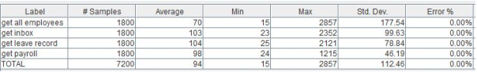

# Project

## Overview of our solution

CI/CD Achieved using AWS CodeBuild, CodeDeploy, CodePipeline. Build, Test and Deployment steps are defined in the buildspec YML files in the app folder

### Maintainability
Design Patterns used: Builder in API Gateway, /gateway/gateway/routes/employee.py

Facade, the entire API Gateway is a facade used to encapsulate and obfuscate the inner workings of our Spring-Boot microservices by providing another layer and a single point of entry for invoking API endpoints

For the ease of deployment and scaling, the application is separated into 4 parts: The frontend web application, the API Gateway, 2 services (Employee microservice, and the rest of the services pagacked as 1)

### Availability
Failover implemented in
1) API Gateway (Load Balancer)
Elastic Load Balancer spreads and balances traffic from different clients across multiple EC2 instances, can scale up to 4 instances under heavy load, minimum of 2 instances running at any point of time
2) Microservices (API Gateway)
Achieved by catching HTTP Request exceptions and using the backup endpoints when an exception is caught

3) Databases (Amazon RDS Failover)
Automatically does DNS rollover when routine pings to the DBs fail. Managed automatically by AWS

### Performance
Caching implemented in API Gateway for Employee Data, possible to extend to other API endpoints as size of data grows

### Security
HTTPS implementation on internet-facing Load Balancer to prevent MITM attacks

Input validation on both client and server to prevent common attacks like SQL Injection, XSS

Restriction of all API calls to only using POST, to mask information such as tokens and employee IDs

Authenticaiton and usage of session tokens to ensure one-way verificaiton and prevent brute force / rainbow table attacks

Access control through firewall (AWS ACL and Security Group) settings to only allow traffic from the API Gateway to reach the backend servers

## Setup Instructions
Our project is structured into 4 main deployment artifacts
1) Gateway (API Gateway) running on Python 3 Flask
2) Main-App, a monolithic Java spring-boot application that hosts the majority of our API endpoints
3) employee-service, a microservice on Java spring-boot that hosts the endpoints of our employee API
4) front-end, a PHP web application that provides the user interface for interacting with the APIs

All API calls are made through HTTP(S) and REST, clients only interface with the API gateway which invokes either Main-App or employee-service endpoints on their behalf.

### ----- API Gateway (PYTHON)------

The API Gateway is located in the folder 'gateway' and is a Python Flask WSGI application.
In order to run the gateway locally, do pip install -r requirements.txt to get the python library dependencies.

To run the gateway, type python Application.py

### ----- Main-App (JAVA)------

Monolithic app encapsulating all API endpoints other than employee related ones. Requires Maven to build and run.

To run the Main Service, type mvnw spring-boot:run
To package into a jar, run mvnw clean package. The jar can be found in the target folder

Configure Spring-Boot settings in application.properties
<<application.properties>>
	server.port --> Port that the microservice runs on

	MySQL connection properties:
	spring.datasource.url --> jdbc:mysql://<<serverAddress>>:<portNumber>>/<<schemaName>>

### ----- employee-service (JAVA)------

Microservice that handles all employee related actions. Requires Maven to build and run.

To run the Employee Service, type mvnw spring-boot:run
To package into a jar, run mvnw clean package. The jar can be found in the target folder

Configure Spring-Boot settings in application.properties
<<application.properties>>
	server.port --> Port that the microservice runs on

	MySQL connection properties:
	spring.datasource.url --> jdbc:mysql://<<serverAddress>>:<portNumber>>/<<schemaName>>

### ----- front-end (PHP)------

This web application has been developed using the WAMP stack.

These are the steps to run the web application.

1. Start WAMP. Note: You do not need a database. 
2. Access the index page by going to localhost/front-end/

For: PHP version >= 7.2.4, HTML 5, Javascript enabled browser.
