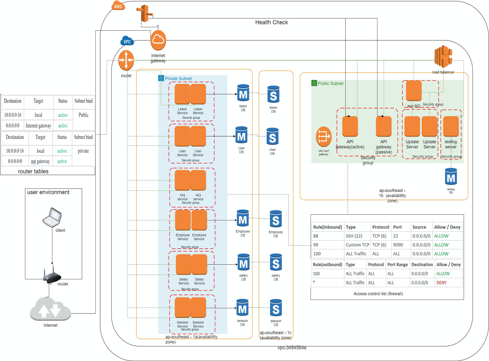

# Project
## Overview of our solution


The business requires a system for its human resource management, which can manage employees' details, calculate their final salary, manage their leaves and generate HR related reports. The Human Resource Management System (HRMS) is an application that can meet all the above needs. The HRMS must be accessible by all 100 employees from their work laptop and always up to date so that they are always accessing the latest data.
 
The work laptop is sometimes brought home by the users; hence, the data must be accessible even after leaving the company premise. The application also must be easy to learn and use. All employees are assigned to a Laptop running the Windows OS.
 
The current HRMS is a monolithic application with a local database. Employees can only apply for leave from a designated work laptop. Updating of data on multiple work laptops with the application is tedious. The application can only be used in the company’s premise. The business wishes to transform this application into one that fulfils the operational needs without compromising the security of the company’s data.
 
Our group will decompose the monolithic application into microservices while retraining most of its functionality. Most microservices will be hosted on the cloud with their respective databases. Our group adopts a high availability architecture with a primary and secondary environment for all load-balanced instances. The secondary databases are passive and retrieve data from the primary database, which is the single source of truth. We also added 2-factor authentication, firewall and access control to enhance application security and safeguard the integrity of the data. The application client also comes with some usability features such as saving last state user inputs and remember my username feature.

# Deployment Diagram/Process


#### Microservice Deployment Automated Testing
Once the development team has finished updating the microservices, they commit and push to Git. Git helps with versioning of the code. Upon pushing into Git, Travis CI will detect the update and automatically pull from Git and build each microservice concurrently (known as a Job). Each job is isolated, compiled and tested (using maven test) and once all jobs have successfully built, it will deploy (using HTTP to a test environment) for further testing. Otherwise, it will simply fail, and Travis CI will notify the user via email

The Test Environment, once it receives the Deploy command from Travis CI, will automatically pull from Git, halt all microservices and compile them before starting them for local testing. 


#### Microservice Deployment to Production
After adequate testing of the microservices, it will be manually deployed to the production server. 

# Solution Overview
### Design Pattern
**Singleton** – The Session Class in the Application client is written with the Singleton Design Pattern as only one instance of Session is required for each login.

**Builder** – The EmployeeBuilder Class hides the complex creation of each Employee Object. Every time the method Load() is called, all employee details will be retrieved from the database through the microservice,the EmployeeBuilder will take in result of the API call to create the individual Employee Object and put them into the Employee ArrayList.

**Factory** – The JSONAPI Factory eases the process of calling JSON API. HTTPURLCONNECTION requires multiple lines of code to successfully make the request. Using the Factory Pattern will reduce the number of repeated codes that have to be written every time a JSON API call is made. As there are multiple types of JSON API Calls (eg. GET, POST, PUT, DELETE), the Factory Pattern is used to defer instantiation to subclasses.

**Facade** – The API Gateway is a single point of entry to our microservices. It is a façade that hides the IP of our services from the request coming in and authenticates them before allowing access to our services, providing a layer of security. The API Gateway directs the incoming traffic to the correct microservice, hence reducing the difficulty of managing multiple services. It also checks the health of each service and load balance the incoming traffic. This ensures the availability and performance of our service.

### Auto Client Updater
The Client is updated automatically upon starting of the client launcher. This eases the process of updating the Client as it can be done remotely without any human assistance. The Launcher will check if the existing application version is the same as the latest version stated on the webpage (version.html). If it is different, the Launcher will download the latest Client (zip file) from our website. It will proceed to unzip it and launch the client application (hrms.exe).

### Remember My Username
We added the option to remember the username as a Usability Feature. The username is stored at Local Data and it will be retrieved loaded on the Login Panel whenever the Application Client is opened.

### Microservice Architecture
Breaking down to microservices improves maintainability as it modularises the functionality of the initial Application Client. It is easier to make changes, test and each microservice can be deployed independently. Failure in an individual microservice will be isolated and not affect the other services. This also makes analysing of the root cause issue easier.

### Client Service Architecture
Initially, all user data are pulled from the database to be used for the login authentication feature of the monolithic application. Sophisticated users can reverse engineer our client application code and get all user information. Hence, we moved the authentication of the user logging into the client application to the User microservice and the Client no longer is able to retrieve all user details from the database. Moving the authentication to a service will improve the security of the data that can be assessed by the client application. 

### Tiered Architecture 
In our Tiered Architecture, the Presentation Layer is largely separated from the Business Logic Tier. Hence, changes in Business Logic that are made in the microservice/gateway will not affect the Application Client. This form of modularization improves maintainability. In addition, since authentication is done in the gateway, which is separated from the application, it also improves the security because even when the Application Client is compromised, the Business Logic (microservice and gateway) and most importantly the Data is still safe.

## Network Diagram


### EndPoints


## State Management

When the user types in anything on the Add New Employee Panel, the last state of the changes made will be stored in the database at an interval of 1 minute. In the event that the Application Client crashes, the user can re-login to the Application Client and the last state saved in the database will be restored.

## Session Management

Every login is tied to the UserID and SessionID. When the same UserID logins again, the associated SessionID (SID1) will be replaced by a new SessionID (SID2) in the database. Thus, when the user attempts to perform any activity that requires the microservices on the first login (SID1), the activity will be halted, and the client application will be killed with a multiple login warning. This is because SID1 is invalid and only the login with SID2 and the same UserID can proceed with activities that interact with the microservices.

## Failure Dectection and Fail-Over

The Route 53 checks on the health of both API Gateway 1 and API Gateway 2 at an interval of 1 minute. The Route 53 checks by pinging the API Gateway. If API Gateway 1 is down while 2 is up, Route 53 will point the domain to API Gateway 2. Subsequent HTTP request entering the domain will be routed to API Gateway 2. 

The Zuul API Gateway (ribbon module) load balances the incoming request using Round Robin. It continuously pings all the servers that it knows of and update a list of healthy servers to route the request to. When a request comes in, it will be routed to a server that is alive and of the required Microservice.

The AWS Relational Database Service with Multi-AZ provides failure support for our databases. It automatically provisions and maintains a synchronous standby replica of our primary database in a different availability zone. The primary database is replicated on a standby replica to provide high availability and data redundancy. When the primary database goes down, Amazon’s failover technology will kick in and point the domain to the replica database. We can access the database through the endpoint provided by AWS.

## Security View


## Performance View


# Running the Application Client
1. Place the entire HRMS folder (updater\Updater Launcher & Client\HRMS) on the Desktop of a PC running Windows OS.
2. Click the HRMS.exe to run the Auto Updater, which will then automatically run the Application Client.

# Running the Application Client Manually
1. Go to (\new-app\hrms\dist) and click the GameMarkStudio.jar to run the Application Client
* The lib folder cannot be removed. The Application Client requires the libraries to run.

# aws setting
1. create a new VPC
2. create two subnets one is private another is public
3. create internet gateway and nat gateway
4. add subnets, internet gateway and nat gateway into the router table
5. create RDS, make sure it is private and under the VPC just created
6. configure the ACL
7. create ec2 instance for microservices(private) and API Gateway(public)
8. configure security group so that microservice server only accept the traffic from api gateway
9. add health check for apigateway 1 and 2
10. configure failover in route 53


# ec2 server server set up
1. run sudo yum update -y
2. install sdkman refer to this link: https://sdkman.io/install
3. install both java and mvn using sdk
4. install java run time on the server (without sdk)
5. add spring boot application into systemctl and configure auto restart as below in /etc/systemd/system
```
[Unit]
Description= service
[Service]
# The configuration file application.properties should be here:
#change this to your workspace
WorkingDirectory=/root/zuul
#path to executable.
#executable is a bash script which calls jar file
ExecStart=[put command with full path here]
SuccessExitStatus=143
Restart=always
TimeoutStopSec=10
RestartSec=5
[Install]
WantedBy=multi-user.target
```
6. register in systemctl
```
sudo systemctl daemon-reload
sudo systemctl enable xxx.service
```

# Deploy spring boot:
1. copy the entire API Gateway spring boot application into server.
2. change the proxy setting in the bootstrap.yml or application.properties.
3. go to the root directory of the spring boot project, build with "mvn clean install"

# Run spring boot application:
1. first method, sudo systemctl start [service name]
2. java -jar [service name].jar

# Notice
Note that this repo is **writable** by you. Any changes you or your team members made in this repo can be pushed to origin. 

If you have changes or discover issues, you can also **create an issue.** ()

