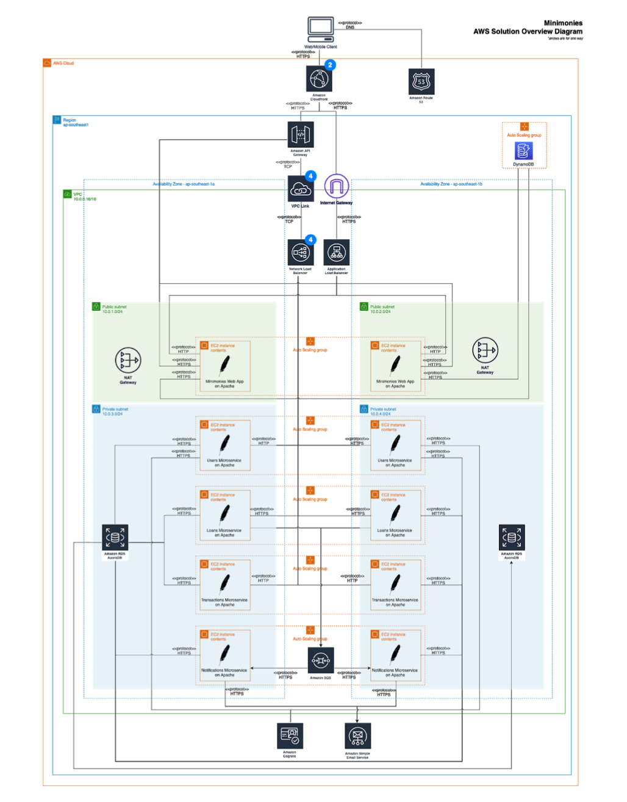

# Project

## Overview of our solution

This project is based on a simulated peer lending app called Minimonies developed in PHP.

This project focuses on the system architecture rather than the app itself.

Please refer to the report for more details on the implementation of the system architecture.

We had a good run, and pardon for the messy codes. If we had more time we would have tidy it up and have a more coherent coding style.
PS: we are just starting out in the Software Dev track.

Awesome team to work with.

Special thanks to Professor Ouh Eng Lieh for never making a single class boring during the entire term. 
It has always been fun and interesting and most importantly, the emphasis was always on the learning portion. 

Cheerio. Regards.
